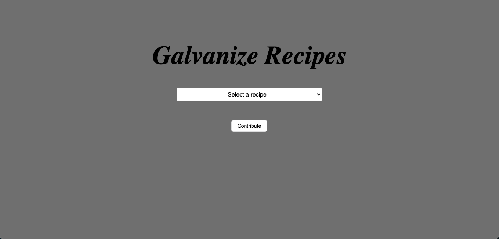
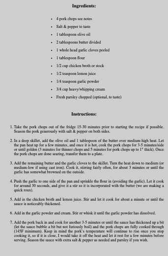
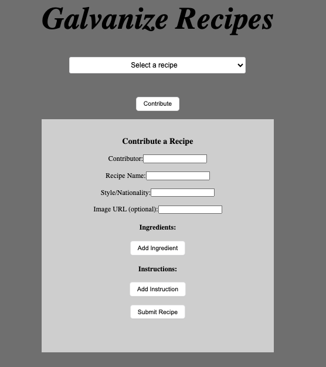

Galvanize Recipes App

The Galvanize Recipes App is a web application designed to display various recipes contributed by the members of Galvanize Operation Level Up MCSPB-2309 cohort. It allows users to view recipes, contribute their own recipes, and browse through different culinary creations.

Functionality:
View Recipes: Users can browse through a list of available recipes.

Recipe Details: Clicking on a specific recipe displays its details, including ingredients, instructions, contributor, style, and an optional image.

Contribute: Users can submit their own recipes by providing details such as contributor, recipe name, style, image (optional), ingredients, and instructions.

Stack Used: The application is built using React for the front-end and Express.js for the back-end. It employs PostgreSQL as the database to store recipe information.

How to Use:

1. Viewing Recipes:

Upon loading the app, a list of available recipes will be displayed.
Select a recipe from the dropdown list to view its details.

2. Contributing Recipes:

Click on the "Contribute" button to add a new recipe.
Fill in the required fields for contributor, recipe name, and style.
Optionally add an image URL.
Add ingredients and instructions by clicking the "Add Ingredient" or "Add Instruction" buttons respectively.
Submit the recipe by clicking the "Submit Recipe" button.

Stack Used
Front-end:

React.js: A JavaScript library for building user interfaces.
HTML/CSS: Used for structuring and styling the web pages.

Back-end:

Express.js: A web application framework for Node.js used to handle server-side logic and routing.
PostgreSQL: A relational database used to store recipe information.

Getting Started
To get started with the app:

1. Clone the repository.
2. Ensure you have Node.js and PostgreSQL installed.
3. Set up the database by running the SQL commands provided in the database.sql file.
4. Install dependencies using npm install.
5. Start the server using npm start.
6. Open the app in your browser at http://localhost:<PORT> (replace <PORT> with the port number configured in your environment).

Developers: Ethan Berkebile

Contributions to the project are welcome! Feel free to submit issues or pull requests.
